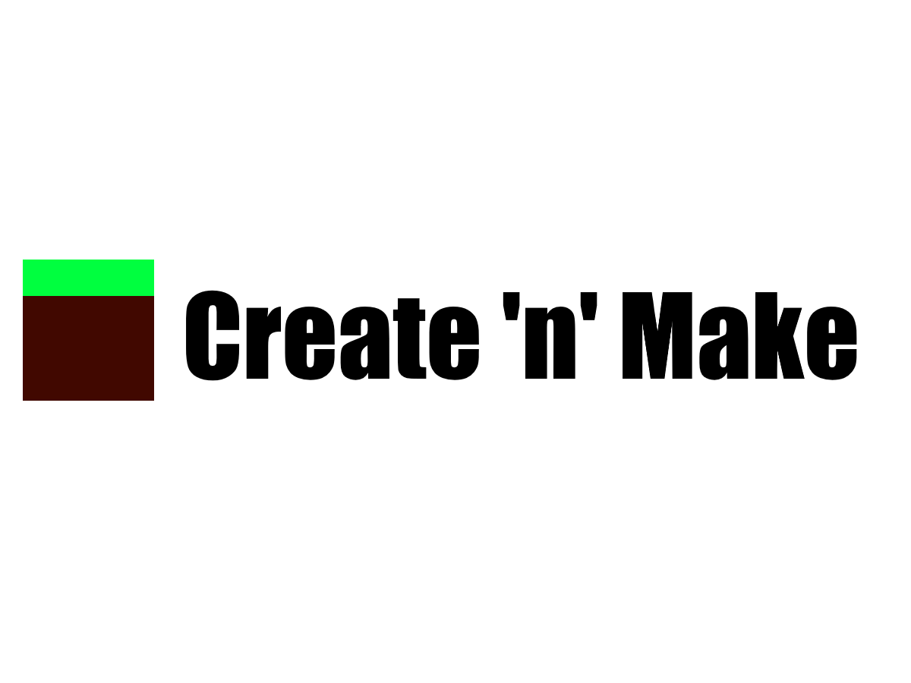

Create 'n' Make, the cubic world template for Godot. Fork of Godotcraft.

## Assets

If you want to run it yourself, you need to download the minecraft assets and put them into the `mcassets` folder into the user folder.  
It's located at `C:\Users\(your username on pc)\AppData\Roaming\Godot\app_userdata\Godotcraft`
InventiveTalent has a repository with all the stuff: https://api.github.com/repos/InventivetalentDev/minecraft-assets/zipball/1.15.2

## Data

You also need some data, you can generate those from a vanilla minecraft server (forks work too).  
`java -cp minecraft_server.jar net.minecraft.data.Main --all`  
You then need to put the data and reports folder into a mcdata folder into the user folder (see above)

## Status

- **Servers and multiplayer:** In development
- **Basic game:** Works properly

## Acknowledgments

Thanks to the following resources:

* ORelio for Minecraft-Console-Client, Godotcraft uses a modified version of their implementation of the datatypes in the mc protocol: https://github.com/ORelio/Minecraft-Console-Client/blob/master/MinecraftClient/Protocol/Handlers/DataTypes.cs
* QuentinCaffeino for godot-console, Godotcraft uses a modified (and ported to c#) version of that project https://github.com/QuentinCaffeino/godot-console
* ShatteredEye Studios for their voxel rendering tutorials
* Mojang for making the game, lol
